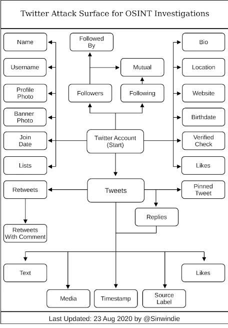

# Metodología de investigación: ciclo de inteligencia (dirección → recolección → procesamiento → análisis → difusión)

## ¿Qué es OSINT?

OSINT (Open Source Intelligence), o inteligencia de código abierto es el proceso de recopilación y análisis de información disponible públicamente de fuentes como cuentas de redes sociales, registros gubernamentales y directorios en línea para evaluar amenazas, tomar decisiones o responder preguntas específicas.

Algunas de las fuentes públicas de las cuales los investigadores de OSINT recopilan datos incluyen:

    Motores de búsqueda de Internet como Google, DuckDuckGo, Yahoo, Bing y Yandex.

    Medios de comunicación impresos y en línea, incluidos periódicos, revistas y sitios de noticias.

    Cuentas en redes sociales en plataformas como Facebook, X, Instagram y LinkedIn.

    Foros en línea, blogs e Internet Relay Chats (IRC).

    El sitio web oscuro, una zona encriptada de Internet que no está indexada por los motores de búsqueda.

    Directorios en línea de números de teléfono, direcciones de correo electrónico y direcciones físicas.

    Registros públicos que incluyen nacimientos, defunciones, documentos judiciales y presentaciones comerciales.

    Registros gubernamentales, como transcripciones de reuniones, presupuestos, discursos y comunicados de prensa emitidos por gobiernos locales, estatales y federales y nacionales.

    Investigación académica: artículos, tesis y revistas.

    Datos técnicos como direcciones IP, API, puertos abiertos y metadatos de sitios web.

## Como usan los hackers OSINT?

Los actores de amenazas a menudo usan OSINT para descubrir información confidencial que pueden aprovechar para explotar vulnerabilidades en redes informáticas.

Esta información puede incluir datos personales sobre los empleados, socios y proveedores de una organización a los que se puede acceder fácilmente en las redes sociales y los sitios web de la empresa. O información técnica como credenciales, brechas de seguridad o claves de cifrado que pueden aparecer en el código fuente de sitios web o aplicaciones en la nube. También hay sitios web públicos que publican información comprometedora, como inicios de sesión y contraseñas robados de filtraciones de datos.

Los delincuentes cibernéticos pueden utilizar estos datos públicos para diversos fines nefastos.

Por ejemplo, podrían usar información personal de las redes sociales para crear correos electrónicos de phishing personalizados que convenzan a los lectores de hacer clic en un enlace malicioso. O realizar una búsqueda en Google con comandos específicos que revelen debilidades de seguridad en una aplicación web, una práctica llamada “Google dorking”. También pueden evadir la detección durante un intento de hackeo luego de revisar los activos públicos de una empresa que describen sus estrategias de defensa de ciberseguridad.

## Ciclo de analisis de inteligencia 

La OSINT está muy ligada al ciclo de análisis de inteligencia y lo utiliza para asegurar los mejores resultados.

Es importante recordar que la OSINT no significa acumular información y datos, estos no tienen valor en sí mismos, su objetivo es conseguir respuestas a las preguntas que nos planteamos.El ciclo de inteligencia es lo que permite transformar esos datos en el conocimiento que deseamos obtener.

## Las fases del ciclo de inteligencia

Al igual que el proceso de trabajo de la OSINT, el ciclo de inteligencia trata de establecer un marco de trabajo basado en buenas prácticas que permita una labor metódica y profesional.

Nada es más habitual que perderse en un mar de datos e información, ir a salto de mata, dejar pasar cosas importantes y olvidarnos de tareas o técnicas, hipnotizados por un hilo que, al final, no lleva a nada.

El novato en ciberinteligencia va de acá para allá, sin lógica ni sistema.

# 1. Direccion
En esta etapa, hacemos dos cosas esenciales:

    Determinamos los objetivos de la investigación, es decir, qué queremos averiguar exactamente.
    Determinamos qué datos iniciales tenemos a nuestra disposición.

Dicho de otro modo, durante esta fase establecemos:

    Dónde queremos llegar.
    Nuestro punto de partida.

Eso nos permite empezar a valorar la distancia que hay de por medio, establecer un primer plan para recorrerla y los posibles caminos principales que usaremos en el inicio del «viaje».

# 2. Recolección

En esta fase, comenzamos a recolectar información útil del objetivo, mediante herramientas automatizadas, trabajo manual, etc.

En esta etapa, es importante seguir un flujo de trabajo óptimo para que no se nos pase nada por alto.
     

Lo contrario sería ir de acá para allá, saltando de una información a otra sin método alguno, olvidando cosas importantes y pasando por alto otras.

Esto es demasiado habitual y uno de los riesgos de trabajar sin un buen proceso. Nada es más común que perderse siguiendo madrigueras de conejo que al final no llegan a ningún lado.

Todo practicante de OSINT tiene (o debe tener, mejor dicho) sus propios flujos de trabajo, basados en su experiencia y también en las mejores prácticas de otros.
Por ejemplo, he aquí el flujo de trabajo OSINT del ciberinvestigador @sinwindie que usa para investigar una cuenta de Twitter.

# Procesamiento 
La información se debe procesar para separar la paja del grano, no acumular información inútil y comprobar que no nos hemos dejado nada importante.

Darle una lógica, estructurarla, indexarla y ordenarla nos facilitará la siguiente fase crítica.

# 4. Análisis 
En OSINT, el problema casi nunca es la falta de datos, sino el exceso. Puedes tener gigabytes de información pública que, si no se interpretan, solo son ruido.El análisis toma esos hechos aislados y los somete a un proceso de interpretación.
En esta etapa, convertimos los datos en conocimiento, analizando, atando cabos y uniendo pistas.

Durante esta fase es habitual descubrir nuevos hilos de investigación, sujetos de interés hacia los que pivotar para extraer más información útil… Aquí es donde veremos que el ciclo de inteligencia es flexible y no tiene una dirección única.
Durante la fase de análisis es muy habitual volver a la recolección y procesamiento, navegando entre estas tres fases una y otra vez hasta lograr el objetivo.

#5. Difusión

Una vez conseguido ese objetivo, debemos entregar la información al cliente o a quien haya ordenado el trabajo.

Esta es la parte que más temen muchos, porque el resultado es un informe para quien ha encargado la investigación OSINT.

Es muy importante comprender que un profesional no dice simplemente lo que se desea saber, sino que entrega también un informe claro de cómo se ha conseguido. Eso implica detallar el proceso de deducción y averiguación de la fase de análisis, de una forma clara y sencilla.

De esta manera, también se asegura que se han usado técnicas correctas de OSINT y que esa información se ha obtenido a partir de fuentes verdaderamente públicas.

Eso permitirá a quien usa la información:

    Ser capaz de reconstruir el camino que ha llevado hacia las conclusiones clave y corroborarlas si es necesario.
    Asegurar la legalidad de los datos y su origen. En caso de ser usados en procesos judiciales, de investigación, etc, blindándose ante posibles alegaciones de haberla obtenido con malas prácticas o saltándose la ley.

Obviamente, si el alcance del trabajo había pactado poder usar fuentes como filtraciones de datos, o bien el uso de técnicas de intrusión (como en el caso de un trabajo de OSINT defensiva), también se especificará claramente.